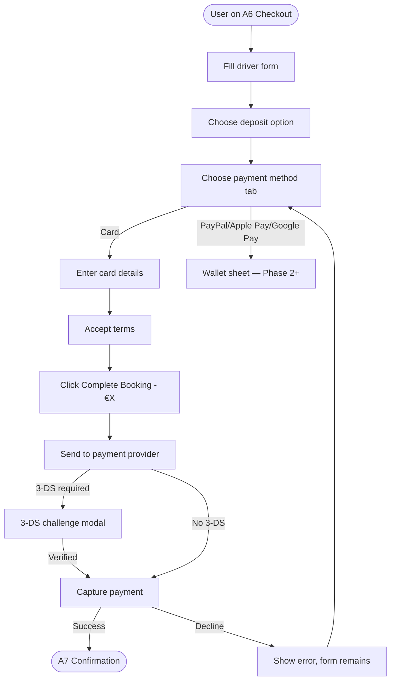
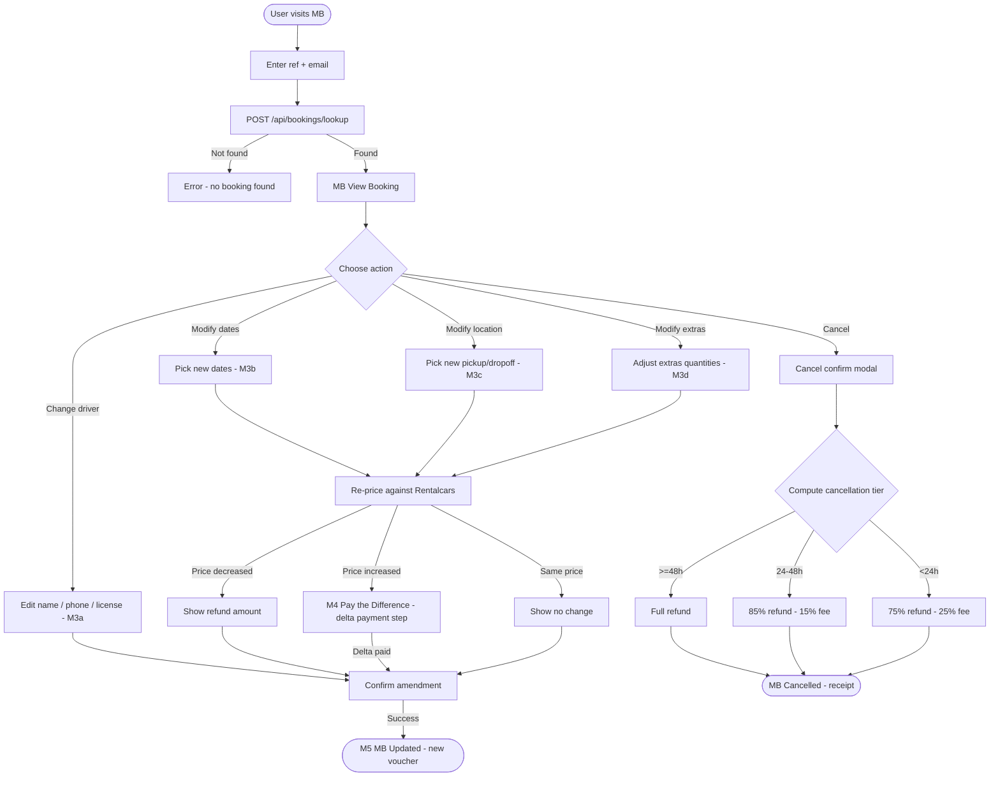

# Iceland Express — UX Logic

> The canonical UX logic document. Pull when designing or building any booking screen.
> Phase B output of the Figma design iteration (2026-07-01).
> Owner: design lead + Claude Code. Update when a flow, state, or schema changes.

---

## 1. The 5-step funnel (shared across all verticals)

Every booking vertical (Cars, Flights, Hotels, Activities) follows the same 5-step funnel. Steps 1–3 are vertical-specific. Steps 4–5 are a **shared engine** that receives a `vertical` config prop and renders vertical-specific labels + endpoints.

```
Step 1  Search Entry      vertical-specific fields       screen XX1 / XX2
Step 2  Results Grid      vertical-specific cards        screen XX2
Step 3  Detail Page       vertical-specific layout       screen XX3
Step 4  Extras            vertical-specific add-ons      screen XX4 (Cars: A5)
Step 5  Checkout → Conf   SHARED ENGINE — vertical prop  A6 → A7 → MB
```

**New vertical = 3 screens (XX2 + XX3 + XX4) + A1 homepage tab update. Never more.** (Architecture law 12)

```
A = Cars         A2 results · A3 detail · A5 extras             → A6 → A7 → MB
B = Flights      B2 results · B3 detail · B4 extras             → A6 → A7 → MB  (Phase 2)
C = Hotels       C2 results · C3 detail · C4 extras             → A6 → A7 → MB  (Phase 3)
D = Activities   D2 results · D3 detail · D4 extras             → A6 → A7 → MB  (Phase 4)
```

The shared engine (A6 checkout, A7 confirmation, MB manage) is built once and parameterised by `vertical={config}`. See §6.

---

## 2. Cars-specific flow (Phase 1 — Rentalcars Connect)

### 2.1 Step-by-step

| Step | Screen | User action | Data captured | Next |
|------|--------|-------------|---------------|------|
| 1 | **A1 Home** | Enter pickup location, pickup date + time, return date + time, driver age (25+ toggle) | `search = { pickupLoc, pickupDate, pickupTime, returnDate, returnTime, driverAge }` | A2 |
| 2 | **A2 Results** | Browse car cards, filter (transmission / fuel / seats / price / Free Cancellation), sort (Recommended / Price / Top Rated), select car | `selectedCar` | A3 |
| 3 | **A3 Detail** | View gallery, specs, included items, tabs (Arrive / Bring / Deposit), price breakdown, click Continue | — | A5 |
| 4 | **A5 Extras** | Add extras with stepper (Insurance / GPS / Child seat / Additional driver / Winter tires / Camping kit / Sleeping bags), see running total | `qty = { gps: 1, wifi: 1, ... }` | A6 |
| 5a | **A6 Checkout** | Fill driver form, choose deposit option, choose payment method, enter card details, accept terms, submit | `form = { first, last, email, phone, dob, licenseCountry, flight, requests, card, expiry, cvv, cardName, agree, marketing }` + `pay = full \| deposit \| pickup` | A7 |
| 5b | **A7 Confirmation** | View booking ref, trip details, add-ons booked, what-happens-next, voucher download, manage-booking link | — | MB (later) |
| Post | **MB Manage** | Retrieve by ref + email (guest), view booking, modify dates / location / extras, cancel | — | — |

### 2.2 Field set per screen (canonical for Phase 1)

These fields are the **canonical Phase 1 spec** (reconciled from the Figma A6 vs prototype drift — see `design/audit-cars-2026-07-01.md` §5.1).

#### A1 Home — `SearchBar` compound
- **Pickup location** — autocomplete, KEF + Reykjavík + city offices
- **Pickup date** — date picker
- **Pickup time** — time select (06:00–22:00 in 30-min steps)
- **Return date** — date picker (≥ pickup date)
- **Return time** — time select
- **Driver age 25+** — boolean toggle (Rentalcars surcharge rules)

#### A6 Checkout — Driver form
- **First name** (required)
- **Last name** (required)
- **Email address** (required, validated)
- **Phone number** (required, +354 default for IS)
- **Date of birth** (required, DD/MM/YYYY — driver must be 25+ per A1 toggle)
- **License country** (required, select — `carsConfig.traveller.licenseCountries`)
- **Flight number (optional)** — text, helper "So we can track delays and adjust your pickup time"
- ~~**Special requests**~~ — **removed from A6** (moved to A5 extras as a note field, or dropped — confirm in Phase E)

#### A6 Checkout — Payment amount
Three options (standardised labels — Figma adopts code labels):
- **Pay in Full** — `€X.XX` · "One payment now"
- **Pay Deposit** — `€X.XX` (50% of total) · "50% now, rest on pickup" · tag "Flexible"
- **Pay at Pickup** — `€0.00` · "No charge today" · tag "Free Today" — only shown if `carsConfig.payment.hasPickupOption === true`

**Dynamic CTA:** the `Complete Booking — €X.XX` button reflects the amount due today based on the selected deposit option. This is a conversion rule (Figma pattern wins — add to prototype in next sprint).

#### A6 Checkout — Payment method
Four tabs (Figma pattern wins — design all 4 now; prototype implements card-only in Phase 1, adds the others in Phase 2+):
- **Card** — Name on Card, Card Number, Expiry (MM/YY), CVV, "Same as driver" checkbox
- **PayPal** — redirect flow (Phase 2+)
- **Apple Pay** — native sheet (Phase 2+)
- **Google Pay** — native sheet (Phase 2+)

#### A6 Checkout — Terms
- **Agree** (required) — "I agree to the Terms & Conditions and Privacy Policy"
- **Marketing** (optional) — `carsConfig.legal.marketingCopy`

#### A6 Checkout — Trust badges
- 🔒 SSL Encrypted
- ✓ Free Cancellation 48h
- 🛡️ Secure Payment

#### A7 Confirmation
- **Booking ref** — `carsConfig.confirmation.refPrefix + 6-char random` (e.g. `ICE-A3F9KX`)
- **Trip details** — Pickup (location + date + time), Return (location + date + time), Duration (days)
- **Add-ons booked** — list of extras with quantities
- **What happens next** — 4 steps from `carsConfig.confirmation.nextSteps`
- **CTA** — "Book another car" (`carsConfig.confirmation.bookAgainLabel`)
- **Manage booking** — link to MB

---

## 3. Per-vertical field matrix

| Field | Cars (A) | Flights (B) | Hotels (C) | Activities (D) |
|-------|----------|-------------|-----------|----------------|
| **Search: location** | Pickup location (autocomplete) | Origin airport + Destination airport | City / hotel name | City / activity name |
| **Search: dates** | Pickup + return dates | Departure + return dates | Check-in + check-out | Activity date |
| **Search: time** | Pickup + return times | (departure time preference — optional) | (check-in time — fixed) | Activity time slot |
| **Search: pax/age** | Driver age 25+ toggle | Adults / children / infants | Rooms / guests / children | Participants |
| **Results: card** | `CarCard` — image, tag, FreeCancBadge, specs, price/day, rating | `FlightCard` — airline, route, times, duration, stops, price | `HotelCard` — image, stars, area, amenities, price/night | `ActivityCard` — image, duration, difficulty, price/person |
| **Results: filters** | Transmission / fuel / seats / price / Free Cancellation | Stops / airline / times / price | Stars / area / amenities / price | Duration / difficulty / group size / price |
| **Detail: hero** | Gallery + spec grid | Route map + fare breakdown | Gallery + room types | Gallery + itinerary |
| **Extras** | Insurance / GPS / Child seat / Additional driver / Winter tires | Bags / seats / meal / lounge | Breakfast / parking / spa / airport shuttle | Photos / video / pickup / group discount |
| **Checkout: traveller** | Driver Details (license, DOB, phone) | Passenger Details (passport, DOB, nationality) | Guest Details (name, email, phone) | Participant Details (name, email, weight/size if needed) |
| **Confirmation: ref prefix** | `ICE-` | `FL-` | `HT-` | `EX-` |
| **Manage: amend** | Modify dates / location / extras · Cancel | (TBD per Duffel) | (TBD per ETG) | (TBD per Bokun) |

Fields not yet confirmed for B/C/D are marked TBD — they are populated when the vertical's API contract is signed (Phase 2/3/4 gates).

---

## 4. State matrix

Every list-bearing screen must handle these 4 states. Every form-bearing screen must handle the form-state variants.

### 4.1 List states (A2 Results, A5 Extras, MB Bookings list)

| State | Trigger | UI |
|-------|---------|----|
| **Default** | Results returned | `CarCard` grid / `ExtraCard` grid |
| **Empty** | Zero results after filters | `EmptyState` — "No cars match your filters" + Reset filters CTA |
| **Loading** | Search in flight | `Skeleton` cards (same layout as `CarCard`, shimmer) |
| **Error** | API down / timeout | `ErrorState` — "Something went wrong" + Retry CTA |
| **Sold out** | Car unavailable after selection (rare — A3 → A5 transition) | Toast + return to A2 |
| **Session expired** | Search session stale (>30min) | Modal — "Your search has expired" + restart CTA |

### 4.2 Form states (A6 Checkout)

| State | Trigger | UI |
|-------|---------|----|
| **Default / empty** | First render | Empty fields, helper text visible |
| **Focused** | Field focused | Focus ring (`T.stroke.focus`), label prominent |
| **Filled** | Field has value | Value shown, no error |
| **Error** | Validation failed | `T.status.danger` border + helper text → error text |
| **Disabled** | Conditional (e.g. card form hidden when pay=pickup) | Opacity 0.45, not interactive |
| **Submitting** | Form sent, awaiting response | `Btn` loading state, spinner, "Processing…" |
| **3-DS challenge** | Card requires SCA | Modal overlay (Phase 2+ — Phase 1 simulates success) |
| **Success** | Booking created | Redirect to A7 |
| **Decline** | Card rejected | Toast + form remains, error text on card field, retry |

### 4.3 Manage booking states (MB)

| State | Prototype `sub` | Trigger |
|-------|-----------------|---------|
| **Lookup** | `lookup` | Initial — ref + email form |
| **Lookup failed** | (within lookup) | No booking found — error text + retry |
| **Found** | `found` | Booking retrieved — summary + actions |
| **Change driver** | `changeDriver` | User clicks Change driver (Figma M3a) — name / phone / license country |
| **Change dates** | `changeDates` | User clicks Modify dates (Figma M3b) |
| **Change location** | `changeLocation` | User clicks Modify location (Figma M3c) — ratified 2026-07-08 as a separate state |
| **Change extras** | `changeExtras` | User clicks Add extras / Modify extras (Figma M3d) |
| **Pay the difference** | `payDifference` | Amendment re-price increased the total (Figma M4) — delta payment step before confirm |
| **Cancel confirm** | `cancelConfirm` | User clicks Cancel — fee tier preview modal |
| **Cancelled** | `cancelled` | Cancel confirmed — refund receipt |
| **Updated** | `updated` | Amendment confirmed — updated voucher (Figma M5) |
| **Amendment failed** | `amendFailed` | Provider rejects amendment — error + retry / contact support |
| **Past pickup** | (banner within `found`) | `now > pickupDate + 2h` — amend/cancel locked, contact support (ratified 2026-07-08) |

---

## 5. Rentalcars Connect field mapping → unified schema

The unified `SearchResult` and `Booking` schemas are provider-agnostic. Each provider has an adapter that maps its external shape to these. This is the contract that lets the shared A6/A7/MB engine work across all 4 verticals.

### 5.1 Unified `SearchResult` (Cars — Rentalcars Connect)

```javascript
// What A2 results receive from /api/search/cars
{
  id: string,                    // Rentalcars vehicle ID
  verticalId: 'cars',            // always 'cars' for this provider
  provider: string,              // "Avis", "Budget", "Hertz", etc.
  name: string,                  // "Dacia Duster" or similar
  year: number,                  // 2023
  catLabel: string,              // "SUV · 4WD"
  img: string,                   // main image URL
  gallery: string[],             // additional image URLs
  perDay: number,                // EUR/day
  currency: 'EUR',               // display currency (ISK secondary)
  perDayIsk: number,             // ISK/day (Iceland context)
  tag: 'Recommended' | 'Best Value' | 'Most Popular' | 'Top Rated' | null,
  rating: number,                // 0-5
  reviews: number,
  seats: number,
  bags: number,
  transmission: 'Manual' | 'Automatic',
  fuel: 'Petrol' | 'Diesel' | 'Hybrid' | 'Electric',
  drive: 'FWD' | 'RWD' | 'AWD' | '4WD',
  minAge: number,                // 25 default
  feats: string[],               // ['Unlimited km', 'Winter Ready', ...]
  freeCancellation: boolean,     // drives FreeCancBadge (law 4)
  included: string[],            // ['Basic Protection', 'CDW', ...]
  priceBreakdown: {              // for PriceBreakdownCard
    baseRate: number,
    taxes: number,
    fees: number,
    total: number,
    currency: 'EUR',
  },
}
```

### 5.2 Unified `Booking` (Cars — Rentalcars Connect)

```javascript
// What A6 creates on submit and what A7/MB receive
{
  ref: string,                   // 'ICE-A3F9KX' — generated client-side, confirmed by backend
  verticalId: 'cars',
  status: 'confirmed' | 'amended' | 'cancelled' | 'pending',
  car: SearchResult,             // the booked car
  search: { pickupLoc, pickupDate, pickupTime, returnDate, returnTime, driverAge },
  qty: { gps: 1, wifi: 1, ... }, // extras quantities
  paid: 'full' | 'deposit' | 'pickup',
  paymentMethod: 'card' | 'paypal' | 'applepay' | 'googlepay',
  driver: { first, last, email, phone, dob, licenseCountry, flight },
  total: number,                 // EUR
  totalIsk: number,              // ISK
  paidToday: number,             // EUR (0 if pay=pickup; 50% if deposit; 100% if full)
  dueAtPickup: number,           // EUR
  bookedOn: Date,
  cancellationTier: 'free' | 'partial' | 'late',  // computed at cancel time
}
```

### 5.3 Rentalcars Connect → unified adapter (spec)

```
Rentalcars search response → normalize() → SearchResult[]
Rentalcars prebook response → normalize() → { prebookHash, priceBreakdown }
Rentalcars book response → normalize() → Booking
Rentalcars amend response → normalize() → Booking (updated)
Rentalcars cancel response → normalize() → { refundAmount, refundCurrency, status }
```

The adapter lives in `apis/providers/cars.provider.js` (per `apis/CLAUDE.md`). The mock lives in `apis/mocks/cars.mock.js`. Both must return the unified shape — screens never see Rentalcars' raw response.

**Other verticals (later phases) follow the same pattern:**
- Flights: `flights.provider.js` (Duffel) → `SearchResult` (verticalId: 'flights') + `Booking`
- Hotels: `hotels.provider.js` (ETG) → `SearchResult` (verticalId: 'hotels') + `Booking`
- Activities: `experiences.provider.js` (Bokun) → `SearchResult` (verticalId: 'activities') + `Booking`

---

## 6. Shared-engine contract (A6 + A7 + MB)

A6, A7, and MB receive a `vertical` prop (defaults to `window.carsConfig` for Phase 1). The vertical config schema is defined in `cars.config.js` (reference). Every other vertical config (`flights.config.js`, `hotels.config.js`, `experiences.config.js`) must implement the same keys.

### 6.1 A6 Checkout — vertical prop usage

| Vertical config key | A6 usage |
|---------------------|----------|
| `checkout.protectionBanner` | `InfoBanner` at top of checkout |
| `checkout.summaryNote(search)` | Note inside `PriceBreakdownCard` |
| `traveller.sectionLabel` | Heading above driver form ("Driver Details" / "Passenger Details") |
| `traveller.hasLicense` | Whether to show license country select |
| `traveller.licenseLabel` | Label for license country select |
| `traveller.licenseCountries` | Options for license country select |
| `traveller.flightHelper` | Helper text under flight number field |
| `traveller.requestsPlaceholder` | Placeholder for special requests textarea |
| `legal.conditionsLabel` | Terms checkbox link text ("Rental Conditions" / "Fare Rules") |
| `legal.marketingCopy` | Marketing opt-in checkbox text |
| `payment.hasPickupOption` | Whether to show "Pay at Pickup" option |

### 6.2 A7 Confirmation — vertical prop usage

| Vertical config key | A7 usage |
|---------------------|----------|
| `confirmation.refPrefix` | Prepended to booking ref |
| `confirmation.tripSectionLabel` | Section heading ("Trip Details" / "Flight Details") |
| `confirmation.originLabel` | Pickup / Departure / Check-in row label |
| `confirmation.destinationLabel` | Return / Arrival / Check-out row label |
| `confirmation.durationLabel` | Duration row label |
| `confirmation.addonsLabel` | Add-ons section heading |
| `confirmation.bookAgainLabel` | "Book another car" / "Book another flight" |
| `confirmation.nextSteps[]` | 4-step "What happens next" list |
| `item.displayName(item)` | Renders item name in summary card |
| `item.categoryKey` | Property to read for category label |
| `item.providerKey` | Property to read for provider name |
| `item.imageKey` | Property to read for image URL |
| `item.specs[]` | Spec badges with icon + property key |

### 6.3 MB Manage — vertical prop usage (to be wired)

MB currently uses hardcoded car-specific rendering. To become a true shared engine, MB must:
1. Accept `vertical` prop (default `carsConfig`)
2. Use `vertical.confirmation.refPrefix` for ref display
3. Use `vertical.confirmation.originLabel` / `destinationLabel` / `durationLabel` in trip rows
4. Use `vertical.item.*` for the item summary card
5. Use `vertical.manage.amendActions` (new config key — to be added) to control which amend actions are available per vertical

**Vertical config additions needed for MB (Phase E):**

```javascript
// Add to cars.config.js (and every vertical config):
manage: {
  hasModifyDriver: true,       // cars: yes (name/phone/license — Figma M3a), flights: no (name changes = re-ticket), hotels: yes, activities: yes
  hasModifyDates: true,        // cars: yes, flights: depends on Duffel, hotels: yes, activities: yes
  hasModifyLocation: true,     // cars: yes (pickup/dropoff), flights: no (origin/dest fixed), hotels: no, activities: yes (pickup point)
  hasModifyExtras: true,       // cars: yes, flights: yes (bags/seats), hotels: yes, activities: maybe
  hasCancel: true,             // all: yes
  cancelTierLabels: {
    free: 'Free Cancellation',
    partial: '15% cancellation fee',
    late: '25% cancellation fee',
  },
  amendInstructions: 'Edit your driver details, dates, location, or extras below. Changes are confirmed by Rentalcars within 60 seconds.',
},
```

---

## 7. Payment happy-path logic (B6)

### 7.1 Happy path



### 7.2 Payment amount logic

| `pay` selection | `paidToday` | `dueAtPickup` | CTA label | Backend action |
|-----------------|-------------|---------------|-----------|----------------|
| `full` | `total` | `0` | `Complete Booking — €{total}` | Sale (capture immediately) |
| `deposit` | `Math.ceil(total * 0.50)` | `total - paidToday` | `Complete Booking — €{paidToday}` | Sale (capture deposit); auth-only for remainder at pickup |
| `pickup` | `0` | `total` | `Complete Booking — €0` | Auth-only (no capture today); full capture at pickup counter |

**Auth-capture note (Phase 2+):** "Pay at Pickup" performs a $0 capture today + a card-on-file token. The actual charge happens at the rental counter. This requires Stripe's `capture_method: 'manual'` (or Rentalcars' equivalent). Phase 1 may simulate this as an immediate $0 auth + token storage.

### 7.3 Failure branches

| Failure | Cause | Recovery |
|---------|-------|----------|
| **Card declined** | Insufficient funds, blocked, etc. | Toast "Your card was declined" + form remains + card field error state + retry |
| **3-DS challenge abandoned** | User closes 3-DS modal | Toast "Authentication cancelled" + form remains + retry |
| **Provider timeout** | Stripe/Rentalcars >30s | `ErrorState` — "Payment timed out" + Retry + "No charge was made" reassurance |
| **Network error** | Client offline | Toast "Network error" + retry |
| **Already booked** | Same car+dates just booked by another user | Modal "This car is no longer available" + return to A2 |
| **Price changed** | Price increased between A3 and A6 submit | Modal "Price has changed from €X to €Y" + Accept new price / Cancel |

### 7.4 Phase 1 scope (cards only)

For Phase 1, **only Card payment is implemented in the prototype**. PayPal, Apple Pay, Google Pay are designed in Figma as visual placeholders but not wired. The payment tabs in the Figma A6 show all 4 — this is the intended end state. The prototype uses a single card form path with simulated success (`setTimeout` 900ms → A7).

---

## 8. Payment + amendment logic (B7)

### 8.1 Happy path



### 8.2 Cancellation tier computation

Source of truth: `backend/config/constants.js` (spec, not yet built). The prototype `screen-MB-manage.jsx` `cancellationFee()` implements this:

```javascript
function cancellationFee(booking) {
  const now = new Date();
  const hoursToPickup = (booking.pickupDate - now) / 3600000;
  if (hoursToPickup > 48) return { label: 'Free Cancellation', fee: 0,    pct: 0   };
  if (hoursToPickup > 24) return { label: '15% cancellation fee', fee: Math.ceil(total * 0.15), pct: 15 };
  return                       { label: '25% cancellation fee', fee: Math.ceil(total * 0.25), pct: 25 };
}
```

| Tier | Hours to pickup | Fee % | Refund % | UI label |
|------|-----------------|-------|----------|----------|
| Free | > 48h | 0% | 100% | "Free Cancellation" |
| Partial | 24–48h | 15% | 85% | "15% cancellation fee" |
| Late | < 24h | 25% | 75% | "25% cancellation fee" |
| Past pickup | < 0h | n/a | 0% | "Past pickup — contact support" (no cancel button) |

### 8.3 Refund / charge logic per deposit choice

The refund amount depends on **both** the cancellation tier AND the original `paid` choice:

| Original `paid` | Tier | Refund calculation | Refund amount |
|-----------------|------|--------------------|---------------|
| `full` | Free | `paidToday * 100%` | `total` |
| `full` | Partial | `paidToday * 85%` | `total * 0.85` |
| `full` | Late | `paidToday * 75%` | `total * 0.75` |
| `deposit` | Free | `paidToday * 100%` | `deposit amount` (50% of total) |
| `deposit` | Partial | `paidToday * 85%` | `deposit * 0.85` |
| `deposit` | Late | `paidToday * 75%` | `deposit * 0.75` |
| `pickup` | Any | n/a — nothing was captured | `€0` (no refund — only the auth token is released) |

**Auth release for `pickup`:** when a "Pay at Pickup" booking is cancelled, the $0 auth is voided and the card-on-file token is released. No money moves. The user sees "Authorisation released, no charge was made."

### 8.4 Amendment re-pricing (Rentalcars `price_increase_percent`)

When modifying dates / location / extras, the new total is computed against Rentalcars' live rates. If the new total is higher than the original, the user must be notified before confirming (ds-rules pattern — never silently raise the price).

```
newTotal = Rentalcars.reprice(booking.car, newSearch, newQty)
delta = newTotal - originalTotal
if (delta > 0) {
  show "Price has changed from €{originalTotal} to €{newTotal}. {delta} will be charged to your card."
  user must click Accept new price
}
if (delta < 0) {
  show "Price has changed from €{originalTotal} to €{newTotal}. €{-delta} will be refunded to your card."
}
if (delta === 0) {
  show "No price change."
}
```

**Price increase threshold:** Rentalcars' `prebook` supports `price_increase_percent` (0–100%). If the increase exceeds the threshold, the original rate is released and the user sees the new rate. Ratified threshold (2026-07-08): **10%** — anything above triggers an explicit user accept.

**M4 — Pay the Difference (delta > 0):** when the re-price increases the total, the amendment is NOT confirmed until the user pays the delta on a dedicated payment step (Figma M4):
- `PriceDeltaRow` shows original total, new total, and the delta.
- Payment method pills (Card / PayPal / Apple Pay / Google Pay — card-only wired in Phase 1).
- Card form pre-notice: "Charged to the card used at booking by default."
- CTA: `Pay €{delta} & Update Booking` — on success → M5 Updated.
- Abandoning M4 leaves the booking unchanged (original rate kept if within `price_increase_percent` hold window; otherwise the user is returned to the amendment form with the new rate).

### 8.5 Amendment failure branches

| Failure | Cause | Recovery |
|---------|-------|----------|
| **Provider rejects amendment** | Rentalcars returns error (car unavailable for new dates, etc.) | `ErrorState` — "We couldn't update your booking" + Retry + "Contact support" link |
| **Refund failed** | Stripe refund call fails | Booking remains in original state + Toast "Refund failed — your booking is unchanged" + "Contact support" link |
| **Past pickup time** | User tries to amend/cancel after pickup datetime | All amend/cancel buttons disabled + banner "Past pickup — contact support to change your booking" |
| **Session expired** | MB lookup session >30min | Modal — "Your session has expired" + re-enter ref + email |

### 8.6 Amendment success states

| State | UI |
|-------|----|
| **Updated** | `ManageUpdated` — green success banner, updated voucher summary, "Download updated voucher" CTA, "Back to booking" link |
| **Cancelled** | `ManageCancelled` — cancelled banner, refund receipt (amount + tier + method), "Book another car" CTA |

---

## 9. Guest-mode constraints (B8)

### 9.1 What guest mode means

- **No user accounts** in Phase 1. No registration, no login, no password, no session persistence beyond the booking ref + email.
- All booking creation (A6) is anonymous — the booking is tied to `driver.email`, not a user ID.
- All booking retrieval (MB) is by `ref + email` pair. Both must match.
- No "my bookings" page, no booking history, no saved payment methods.

### 9.2 What this implies for design

| Screen | Implication |
|--------|-------------|
| A1 Home | No "Sign in" CTA in NavBar. CTA is "Manage Booking" (which opens MB lookup) |
| A6 Checkout | No "Save my details" checkbox. No "Create account after booking" upsell. Form is one-shot. |
| A7 Confirmation | No "Create account to manage your booking" CTA. Booking is managed via the ref + email link in the confirmation email + on-screen. |
| MB Retrieve | Form is just `ref` + `email`. No "forgot password". No social login. |
| MB View | No "account settings". No "saved cars". Just the booking + amend/cancel actions. |

### 9.3 Security constraints

- The `ref + email` pair is the **only** authentication for MB. Email must match exactly (case-insensitive).
- Refs are 6-char random uppercase (`ICE-A3F9KX`) — 36^6 = ~2.2B combinations. Email is the second factor.
- Rate limit MB lookup: 5 attempts per IP per 5 minutes. Lockout for 15 min after 5 failures.
- All amend/cancel actions send a confirmation email to `driver.email`.
- Voucher download is gated by the same `ref + email` session.

### 9.4 Phase 2+ accounts (out of scope this round)

When accounts are added (Phase 2+ per `backend/CLAUDE.md`):
- Guest bookings can be "claimed" into an account by signing up with the same email.
- MB then offers both "guest lookup" (ref + email) and "sign in" paths.
- Saved payment methods, booking history, and preferences become possible.

This is **not** designed this round. The Figma flow assumes guest-mode only.

---

## 10. Edge cases

| Case | Handling |
|------|----------|
| **Same pickup + return location** | Allowed. UI shows one location field with "Return to same location" checkbox (default on). |
| **Return before pickup** | Date picker disables return dates before pickup. Time picker disables return times before pickup time on the same day. |
| **>30 days rental** | Rentalcars max is 30 days. A1 search validates: `returnDate - pickupDate <= 30`. Error: "Maximum rental is 30 days." |
| **Driver under 25** | A1 toggle. If off, A2 filters out cars with `minAge > driverAge`. Surcharge shown in `PriceBreakdownCard` line item. |
| **Driver under 21** | Not allowed. A1 toggle minimum age is 21 (Rentalcars rule). |
| **No cars available** | A2 empty state — "No cars available for these dates. Try different dates or locations." + CTA to A1. |
| **Pickup location closed at chosen time** | A1 time picker disables closed hours per location. Helper: "{location} is closed at this time." |
| **Flight delay** | If `flight` provided, backend tracks flight status and auto-adjusts pickup time. Email sent to driver. Out of scope Phase 1 (manual in Phase 2). |
| **Currency display** | EUR is primary, ISK is secondary (Iceland context). All prices show `€X.XX` with `ISK X` below in smaller text. |
| **Language** | i18n default is English. IP detection on first load switches to IS/EN/DA/DE/FR based on `languageService.js` mapping. Override in localStorage. |

---

## 11. Open questions — RATIFIED 2026-07-08 (see DECISIONS.md)

All 8 questions were ratified with the documented recommendations:

1. **A6 field set** — Phone + DOB + License Country + Flight Number (optional) are all Phase 1 scope. ✅
2. **Payment methods in Phase 1** — Card-only wired in prototype; PayPal/Apple Pay/Google Pay are visual placeholders for Phase 2+. ✅
3. **`Special requests` TxtArea** — removed from A6 entirely. ✅
4. **ManageChangeLocation** — kept as a separate MB state. ✅
5. **Light mode** — dark-only for Phase 1. ✅
6. **`price_increase_percent` threshold** — 10%; above triggers explicit user accept (M4 Pay the Difference). ✅
7. **MB lookup rate limit** — 5 attempts per IP per 5 minutes, 15-min lockout. ✅
8. **Past-pickup cutoff** — 2-hour grace period (`now > pickupDate + 2h` locks amend/cancel). ✅

---

## 12. Update rules

```
WHO updates this file:    Claude Code whenever a flow, state, schema, or edge case changes
WHEN:
  - a new screen or state is added
  - the vertical config schema changes (cars.config.js or any other vertical config)
  - the cancellation policy changes (backend/config/constants.js)
  - a new payment method is added
  - a new amendment action is added
  - the guest-mode contract changes (e.g. accounts added in Phase 2)

NEVER:
  - change a flow without updating the corresponding Figma frame
  - document a state that isn't reflected in the prototype
  - remove an edge case without checking it's handled
```

---

*IcelandExpress · docs/ux-logic.md · v1.0 · 2026-07-01*
*Owner: design lead + Claude Code — update when any flow, state, or schema changes*
